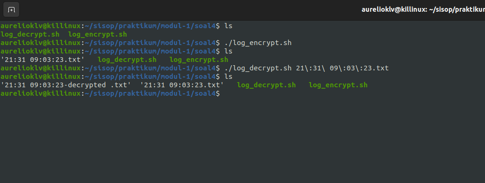
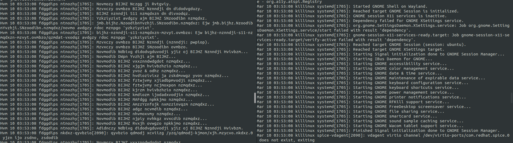

# sisop-praktikum-modul-1-2023-BS-D04

## Anggota Kelompok:
1. Abdullah Nasih Jasir - 5025211111
2. Aurelio Killian Lexi V - 5025211126
3. Sony Hermawan - 5025211226

## Soal
1. Bocchi hendak melakukan University Admission Test di Jepang. Bocchi ingin masuk ke universitas yang bagus. Akan tetapi, dia masih  bingung sehingga ia memerlukan beberapa strategi untuk melakukan hal tersebut. Untung saja Bocchi menemukan file .csv yang berisi ranking universitas dunia untuk melakukan penataan strategi  :
    * Bocchi ingin masuk ke universitas yang bagus di Jepang. Oleh karena itu, Bocchi perlu melakukan survey terlebih dahulu. Tampilkan 5 Universitas dengan ranking tertinggi di Jepang.
    * Karena Bocchi kurang percaya diri, coba cari Faculty Student Score(fsr score) yang paling rendah diantara 5 Universitas dari hasil filter poin a.
    * Karena Bocchi takut salah membaca ketika memasukkan nama universitas, cari 10 Universitas di Jepang dengan Employment Outcome Rank(ger rank) paling tinggi.
    * Bocchi ngefans berat dengan universitas paling keren di dunia. Bantu bocchi mencari universitas tersebut dengan kata kunci keren.

2. Kobeni ingin pergi ke negara terbaik di dunia bernama Indonesia. Akan tetapi karena uang Kobeni habis untuk beli headphone ATH-R70x, Kobeni tidak dapat melakukan hal tersebut. 
    * Untuk melakukan coping, Kobeni mencoba menghibur diri sendiri dengan mendownload gambar tentang Indonesia. Coba buat script untuk mendownload gambar sebanyak X kali dengan X sebagai jam sekarang (ex: pukul 16:09 maka X nya adalah 16 dst. Apabila pukul 00:00 cukup download 1 gambar saja). Gambarnya didownload setiap 10 jam sekali mulai dari saat script dijalankan. Adapun ketentuan file dan folder yang akan dibuat adalah sebagai berikut:
        - File yang didownload memilki format nama “perjalanan_NOMOR.FILE” Untuk NOMOR.FILE, adalah urutan file yang download (perjalanan_1, perjalanan_2, dst)
        - File batch yang didownload akan dimasukkan ke dalam folder dengan format nama “kumpulan_NOMOR.FOLDER” dengan NOMOR.FOLDER adalah urutan folder saat dibuat (kumpulan_1, kumpulan_2, dst)
    * Karena Kobeni uangnya habis untuk reparasi mobil, ia harus berhemat tempat penyimpanan di komputernya. Kobeni harus melakukan zip setiap 1 hari dengan nama zip “devil_NOMOR ZIP” dengan NOMOR.ZIP adalah urutan folder saat dibuat (devil_1, devil_2, dst). Yang di ZIP hanyalah folder kumpulan dari soal di atas.

3. Peter Griffin hendak membuat suatu sistem register pada script louis.sh dari setiap user yang berhasil didaftarkan di dalam file /users/users.txt. Peter Griffin juga membuat sistem login yang dibuat di script retep.sh
    * Untuk memastikan password pada register dan login aman, maka ketika proses input passwordnya harus memiliki ketentuan berikut
        - Minimal 8 karakter
        - Memiliki minimal 1 huruf kapital dan 1 huruf kecil
        - Alphanumeric
        - Tidak boleh sama dengan username 
        - Tidak boleh menggunakan kata chicken atau ernie
    * Setiap percobaan login dan register akan tercatat pada log.txt dengan format : YY/MM/DD hh:mm:ss MESSAGE. Message pada log akan berbeda tergantung aksi yang dilakukan user.
        - Ketika mencoba register dengan username yang sudah terdaftar, maka message pada log adalah REGISTER: ERROR User already exists
        - Ketika percobaan register berhasil, maka message pada log adalah REGISTER: INFO User USERNAME registered successfully
        - Ketika user mencoba login namun passwordnya salah, maka message pada log adalah LOGIN: ERROR Failed login attempt on user USERNAME
        - Ketika user berhasil login, maka message pada log adalah LOGIN: INFO User USERNAME logged in

4. Johan Liebert adalah orang yang sangat kalkulatif. Oleh karena itu ia mengharuskan dirinya untuk mencatat log system komputernya. File syslog tersebut harus memiliki ketentuan : 
    * Backup file log system dengan format jam:menit tanggal:bulan:tahun (dalam format .txt).
    * Isi file harus dienkripsi dengan string manipulation yang disesuaikan dengan jam dilakukannya backup seperti berikut:
        - Menggunakan sistem cipher dengan contoh seperti berikut. Huruf b adalah alfabet kedua, sedangkan saat ini waktu menunjukkan pukul 12, sehingga huruf b diganti dengan huruf alfabet yang memiliki urutan ke 12+2 = 14
        - Hasilnya huruf b menjadi huruf n karena huruf n adalah huruf ke empat belas, dan seterusnya.
        - Setelah huruf z akan kembali ke huruf a
    * Buat juga script untuk dekripsinya.
    * Backup file syslog setiap 2 jam untuk dikumpulkan 😀.

## PENJELASAN DAN CODE

### SOAL NOMOR 1

#### 1a. Menampilkan 5 Universitas Terbaik di Jepang ####

    awk -F',' '/Japan/ {print $2}' Praktikum1.csv | head -5

` -F',' `
digunakan untuk memisahkan inisialisasi kolom 1, 2, 3 dan seterusnya menggunakan pemisah koma ','

` '/Japan/ {print $2}' Praktikum1.csv `
/Japan/ digunakan untuk mencari seluruh universitas yang berada di Jepang. Printah "{print $2} Praktikum1.csv" menandakan hanya kolom kedua yang dikeluarkan dari file Praktkum1.csv. Selanjutnya, head -5 digunakan untuk membatasi output sesuai 5 data teratas

#### 1b. Menampilkan 5 Univeritas di Jepang dengan FSR Score Terendah

    LC_ALL=C sort -t',' -k9,9n Praktikum1.csv | awk -F',' '/Japan/ {print $2}' | head -5

` LC_ALL=C `
digunakan untuk membaca titik sebagai koma sehingga angka tersebut terbaca sebagai angka desimal

` sort -t',' -k9,9n Praktikum1.csv `
sort -k9,9n adalah perintah untuk mengurutkan data pada kolom ke sembilan di mana pemisah setiap kolom dituliskan dengan perintah -t','. "9n" memiliki arti kolom ke sembilan diurutkan berdasarkan numerical atau ascending.

` awk -F',' '/Japan/ {print $2}' `
setelah mengurutkan seluruh data berdasarkan FSR Score terendah, perintah di atas memiliki arti untuk mengambil universitas di Jepang saja dengan syntax /Japan/ dan menggeluarkan output pada kolom ke dua saja.

` head -5 `
mengemabil 5 data teratas saja

#### 1c. Menampilkan 10 universitas dengan GER Rank Tertinggi di Jeoang

    sort -t',' -k20,20n Praktikum1.csv | awk -F',' '/Japan/ {print $2}' | head -10

` sort -t',' -k20,20n Praktikum1.csv `
code di atas adalah perintah untuk mengurutkan data pada kolom ke dua puluh di mana pemisah setiap kolom tersebut adalah sebuah koma.Huruf n setelah angka 20 memiliki arti kolom ke dua puluh diurutkan berdasarkan numerical atau ascending.

` awk -F',' '/Japan/ {print $2}' `
perintah di atas memiliki arti untuk mengambil universitas di Jepang saja dengan syntax /Japan/ dan menggeluarkan output pada kolom ke dua saja.

` head -10 `
mengemabil 10 data teratas saja

#### 1d. Menampilkan Uiversitas Terkeren

    awk -F',' '/Keren/ {print $2}' Praktikum1.csv

perintah di atas memiliki arti untuk mengambil universitas dengan indikator Keren dan menggeluarkan output pada kolom ke dua saja.

#### Hasil Bash university_survey.sh
 

### SOAL NOMOR 2

#!/bin/bash

##### Fungsi Download
```
function download_images {
  #  Mendapatkan jam dalam format 24 jam
  HOUR=$(date +"%H")
	
  #  Jika jam 0 berarti lakukan 1 download selain itu sesuai dengan angka jam
  if [[ $HOUR -eq 0 ]]; then
      COUNT=1
  else
      COUNT=$HOUR
  fi
```


  #####  Mencari urutan folder berikutnya (kumpulan_0, kumpulan_1, ..., kumpulan_n)
```
  COUNTFOLDER=1
  while [[ -d "kumpulan_$COUNTFOLDER" ]]; do
      (( COUNTFOLDER++ ))
  done
```

  #####  Membuat directory untuk menyimpan foto, lalu mkdir yaitu membuat directory sesuai dengan hasil "COUNTFOLDER"
```
  DIRECTORY="kumpulan_$COUNTFOLDER"
  mkdir "$DIRECTORY"
```


  #####  Download image dari Indonesia melalui website Unsplash
```
  for (( i=1; i<=$COUNT; i++ ))
  do
      FILENAME="perjalanan_$i.jpg"
      echo "Downloading $FILENAME to $DIRECTORY"
	  wget --referer="https://unsplash.com/s/photos/indonesia" -q https://source.unsplash.com/800x600/?indonesia -O "$DIRECTORY/$FILENAME"       
	done
```

}

#####  Fungsi Zip
```
function zip_files {
	# Mencari urutan folder berikutnya (devil_1, devil_2, ..., devil_n)
    COUNTZIP=1
    while [[ -f "devil_$COUNTZIP.zip" ]]; do
        (( COUNTZIP++ ))
    done

    # Zip semua folder menggunakan Wild Card "kumpulan_*"
    zip -r "devil_$COUNTZIP.zip" kumpulan_*

	# Menghapus semua menggunakan Wild Card
    rm -r kumpulan_*/
}
```


#####  User input [download/zip] untuk memudahkan proses cronjob
```
if [[ $1 == "download" ]]; then
  download_images
elif [[ $1 == "zip" ]]; then
  zip_files
else
  echo "[download|zip]"
fi
```


##### Cron Job
```
#  Melakukan fungsi download setiap 10 jam
#  1 */10 * * * /home/adonis/adonis/praktikum1/kobeni_liburan.sh download
#  Melakukan fungsi zip setiap hari baru
#  0 0 * * * /home/adonis/adonis/praktikum1/kobeni_liburan.sh zip
```
#### Hasil dari program diatas yaitu 
#### kobeni_liburan.sh Execute :

#### Isi folder perjalanan : 

#### Isi zip devil : 


#### Kendala yang dialami dalam pengerjaan soal ini
- Sulit menemukan website untuk mengambil foto _random_ tentang Indonesia
- Cron Job mengoutput file / zip di dalam directory "$HOME" atau "/~" tidak di directory dimana file "kobeni_liburan.sh" berada

### SOAL NOMOR 3

#### Louis.sh
---
    #!/bin/bash
    function register {
```
        echo "-----Register-----"
        echo -n "Enter username: "
        read new_username
        echo -n "Enter password: "
        read -s new_password
        echo ""
```

##### Membuat file log.txt jika tidak ada
```
        if [ ! -f log.txt ]; then
            touch log.txt
        fi
	
```

##### Mengecek jika username sudah terdaftar di file /users/users.txt dan menggunakan grep yang berfungsi mencari suatu kata di file /users/users.txt dan -q yang berarti quiet dimana grep tidak akan mengoutputkan hasil ke terminal
```
        if grep -q "^$new_username:" /users/users.txt; then
            echo "REGISTER: ERROR User already exists"
            echo "$(date +"%y/%m/%d %H:%M:%S") REGISTER: ERROR User already exists" >> log.txt
```

##### Mengecek jika password memenuhi ketentuan yang ditentukan. Dalam kasus ini grep digunakan untuk mengambil output dari echo $"new_password" dimana "$new_password" berupa user input dan "|" (Pipe) akan melempar output dari echo ke grep lalu digunakan pattern yaitu '[A-Z]' dimana pattern ini akan mengambil semua huruf besar
```
        elif ! echo "$new_password" | grep -q '[A-Z]' || ! echo "$new_password" | grep -q '[a-z]' || ! echo "$new_password" | grep -q '[0-9]'; then
            echo "REGISTER: ERROR Password tidak memenuhi ketentuan"
            echo "$(date +"%y/%m/%d %H:%M:%S") REGISTER: ERROR Password memerlukan minimal 1 huruf besar, 1 huruf kecil, dan 1 angka" >> log.txt
```

##### Mengecek jika password == chicken
```
        elif echo "$new_password" | grep -q 'chicken'; then
            echo "REGISTER: ERROR Password tidak boleh mengandung kata chicken"
            echo "$(date +"%y/%m/%d %H:%M:%S") REGISTER: ERROR Password tidak boleh mengandung kata chicken" >> log.txt
```

##### Mengecek jika password == ernie
```
        elif echo "$new_password" | grep -q 'ernie'; then
            echo "REGISTER: ERROR Password tidak boleh mengandung kata ernie"
            echo "$(date +"%y/%m/%d %H:%M:%S") REGISTER: ERROR Password tidak boleh mengandung kata ernie" >> log.txt
```

##### Mengecek jika password sama dengan username
```
        elif [ "$new_password" = "$new_username" ]; then
            echo "REGISTER: ERROR Password tidak boleh sama dengan username"
            echo "$(date +"%y/%m/%d %H:%M:%S") REGISTER: ERROR Password tidak boleh sama dengan username" >> log.txt
```

##### Menambahkan username dan password baru ke file /users/users.txt		
```
        else 
            echo "$new_username:$new_password" >> /users/users.txt
            echo "REGISTER: INFO User $new_username registered successfully"
            echo "$(date +"%y/%m/%d %H:%M:%S") REGISTER: INFO User $new_username registered successfully" >> log.txt
        fi
    }
register
```

    
---

#### Retep.sh
---
```
     #!/bin/bash
     function login {
        echo "-----Login-----"
        echo -n "Enter username: "
        read username
        echo -n "Enter password: "
        read -s password
        echo ""
```

##### Mengecek kesesuaian username dan password yang berada pada /users/users.txt
```
        if ! grep -q "^$username:$password" /users/users.txt; then
            echo "LOGIN: ERROR Failed login attempt on user $username"
            echo "$(date +"%y/%m/%d %H:%M:%S") LOGIN: ERROR Failed login attempt on user $username" >> log.txt
        else
```


##### Jika sesuai maka berhasil maka outputkan logged in dan jalan function "login"
```
            echo "LOGIN: INFO User $username logged in"
            echo "$(date +"%y/%m/%d %H:%M:%S") LOGIN: INFO User $username logged in" >> log.txt
        fi
     }
     login
```

---

#### Hasil dari 2 program diatas yaitu 
#### Louis.sh & Retep.sh Execute :

#### Isi folder /users/users.txt : 

#### Isi folder log.txt : 


#### Kendala yang dialami dalam pengerjaan soal ini
Menggunakan "AWK", di pengerjaan soal ini penggunaan "AWK" digantikan dengan "grep"

### SOAL NOMOR 4
#### Encrypt
##### Pertama, buat beberapa variabel untuk menyimpan waktu dibuatnya file enkripsi.
```
#!/bin/bash

cd "$(dirname "$0")"
hour=$(date +"%-H")
path=$(pwd)
filename=$(date +"%H:%M %d:%m:%y")
fullpath="$path/$filename"
```
##### Fungsi untuk menggeser tiap karakter sebanyak dengan jam dibuatnya file dapat dilakukan menggunakan command ```tr``` dengan dua argumen yaitu list karakter yang ingin denkripsi dan list karakter hasil enkripsi. Fungsi ```encrypt``` memiliki dua parameter, yaitu string yang ingin dienkripsi serta jam pembuatan file.
```
encrypt() {
	msg=$1
	shift=$2
	
	lowercase=abcdefghijklmnopqrstuvwxyzabcdefghijklmnopqrstuvwxyz
	uppercase=ABCDEFGHIJKLMNOPQRSTUVWXYZABCDEFGHIJKLMNOPQRSTUVWXYZ
	encrypted=$(echo $msg | tr "${lowercase:0:26}" "${lowercase:${shift}:26}" | tr "${uppercase:0:26}" "${uppercase:${shift}:26}")
	
	echo $encrypted
}
```
##### Kemudian, isi pesan pada ```syslog``` diambil dan dibaca tiap barisnya menggunakan command ```read```. Tiap baris pada syslog kemudian menjadi argumen pada fungsi ```encrypt()``` dan hasil enkripsinya ditambahkan (append) ke dalam file.
```
cat /var/log/syslog | while read line 
do
	encrypt "$line" $hour >> "$fullpath".txt
done
```
##### Konfigurasi Cron Job
```	
# Konfigurasi cron
# 0 */2 * * * /path/to/log_encrypt.sh
# 0 */2 * * * /home/aurelioklv/sisop/praktikum/modul-1/soal4/log_encrypt.sh
```
#### Decrypt
##### Pertama, dapatkan jam dibuatnya file. Jam tersebut menjadi kunci untuk melakukan dekripsi. Parsing jam dari nama file dapat dilakukan dengan command ```sed``` untuk menghapus *leading zero*.
```
#!/bin/bash

target=$1
hour=$(echo ${target:0:2} | sed 's/^0*//')
path=$(pwd)
filename="$(basename -s .txt $target)-decrypted"
fullpath="$(echo "$path/$filename"|tr '\n' ' ')"
```
##### Fungsi untuk dekripsi pada dasarnya sama dengan enkripsi. Perbedaanya terletak pada variabel ```shift```.Untuk melakukan dekripsi suatu karakter, maka akan dilakukan penggeseran sehingga jumlah penggeseran bernilai 26 (kembali ke karakter semula). Oleh karena itu, nilai variabel ```shift``` adalah 26 dikurangi jam dibuatnya file enkripsi. Fungsi ```decrypt``` akan menerima 2 argumen, yaitu nama file enkripsi dan jam pembuatannya.
```
decrypt() {
	msg=$1
	shift=(26-$2)
	
	lowercase=abcdefghijklmnopqrstuvwxyzabcdefghijklmnopqrstuvwxyz
	uppercase=ABCDEFGHIJKLMNOPQRSTUVWXYZABCDEFGHIJKLMNOPQRSTUVWXYZ
	decrypted=$(echo $msg | tr "${lowercase:0:26}" "${lowercase:${shift}:26}" | tr "${uppercase:0:26}" "${uppercase:${shift}:26}")
	
	echo $decrypted
}
```
##### Untuk melakukan proses dekripsi, file target akan dibaca terlebih dahulu menggunakan ```cat``` dan ```read```. Kemudian tiap baris dari hasil ```read``` akan dijadikan sebagai argumen pada fungsi ```decrypt```. Hasil dekripsi kemudian ditambahkan pada file hasil dekripsi.
```
cat "$target" | while read line 
do
	decrypt "$line" $hour >> "$fullpath".txt
done
```
#### Screenshot  
- Eksekusi

- Hasil
  
#### Kendala  
- Pembuatan nama file lumayan tricky
- Proses backup syslog lumayan memakan waktu (tergantung isi)
