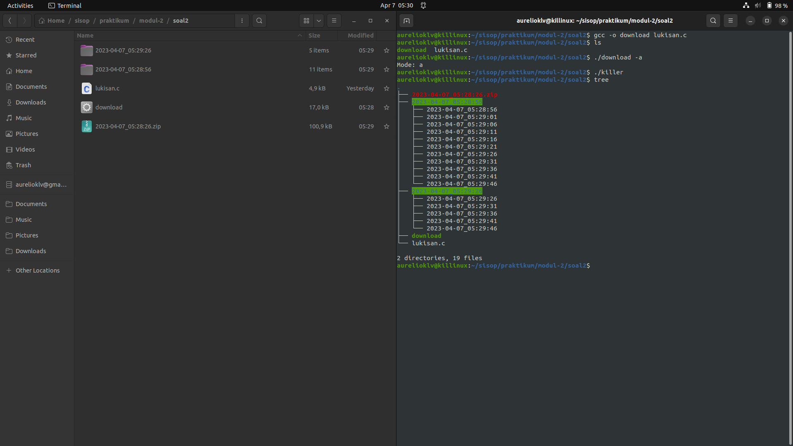
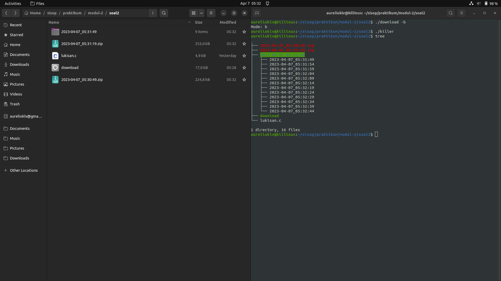
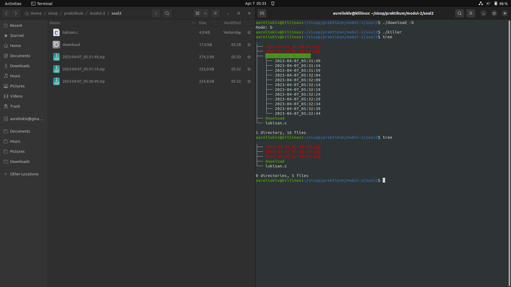
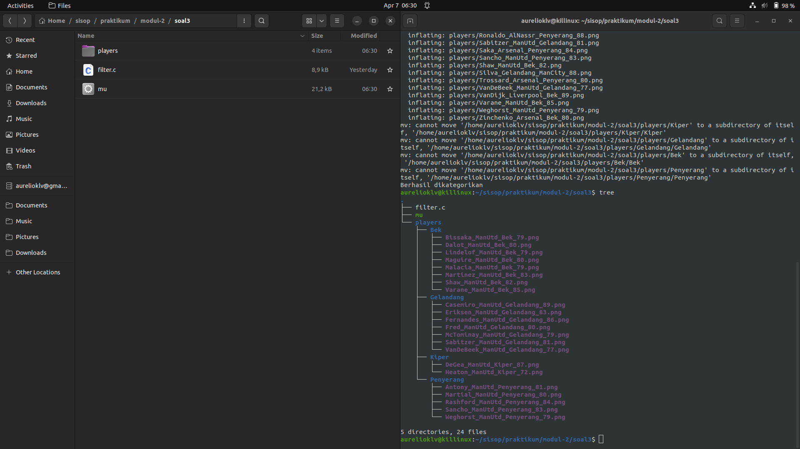
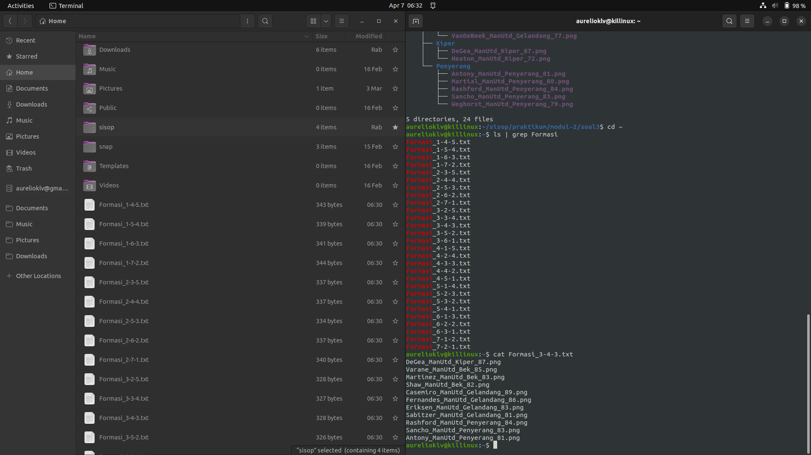

# sisop-praktikum-modul-2-2023-BS-D04

## Anggota Kelompok:
1. Abdullah Nasih Jasir - 5025211111
2. Aurelio Killian Lexi Verrill - 5025211126
3. Sony Hermawan - 5025211226

## SOAL  
1.  Grape-kun adalah seorang penjaga hewan di kebun binatang, dia mendapatkan tugas dari atasannya untuk melakukan penjagaan pada beberapa hewan-hewan yang ada di kebun binatang sebelum melakukan penjagaan Grape-kun harus mengetahui terlebih dahulu hewan apa aja yang harus dijaga dalam drive kebun binatang tersebut terdapat folder gambar dari hewan apa saja yang harus dijaga oleh Grape-kun. Berikut merupakan link download dari drive kebun binatang tersebut : https://drive.google.com/uc?export=download&id=1oDgj5kSiDO0tlyS7-20uz7t20X3atwrq 

 * Grape-kun harus mendownload file tersebut untuk disimpan pada penyimpanan local komputernya. Dan untuk melakukan melihat file gambar pada folder yang telah didownload Grape-kun harus melakukan unzip pada folder tersebut.
 * Setelah berhasil melakukan unzip Grape-kun melakukan pemilihan secara acak pada file gambar tersebut untuk melakukan shift penjagaan pada hewan tersebut.
 * Karena Grape-kun adalah orang yang perfeksionis Grape-kun ingin membuat direktori untuk memilah file gambar tersebut. Direktori tersebut dengan nama HewanDarat, HewanAmphibi, dan HewanAir. Setelah membuat direktori tersebut Grape-kun harus melakukan filter atau pemindahan file gambar hewan sesuai dengan tempat tinggal nya.
 * Setelah mengetahui hewan apa saja yang harus dijaga Grape-kun melakukan zip kepada direktori yang dia buat sebelumnya agar menghemat penyimpanan.

    Catatan : 
* untuk melakukan zip dan unzip tidak boleh menggunakan system

2.  Sucipto adalah seorang seniman terkenal yang berasal dari Indonesia. Karya nya sudah terkenal di seluruh dunia, dan lukisannya sudah dipajang di berbagai museum mancanegara. Tetapi, akhir-akhir ini sucipto sedang terkendala mengenai ide lukisan ia selanjutnya. Sebagai teman yang jago sisop, bantu sucipto untuk melukis dengan mencarikannya gambar-gambar di internet sebagai referensi !

* Pertama-tama, buatlah sebuah folder khusus, yang dalamnya terdapat sebuah program C yang per 30 detik membuat sebuah folder dengan nama timestamp [YYYY-MM-dd_HH:mm:ss].
* Tiap-tiap folder lalu diisi dengan 15 gambar yang di download dari https://picsum.photos/ , dimana tiap gambar di download setiap 5 detik. Tiap gambar berbentuk persegi dengan ukuran (t%1000)+50 piksel dimana t adalah detik Epoch Unix. Gambar tersebut diberi nama dengan format timestamp [YYYY-mm-dd_HH:mm:ss].
* Agar rapi, setelah sebuah folder telah terisi oleh 15 gambar, folder akan di zip dan folder akan di delete(sehingga hanya menyisakan .zip).
* Karena takut program tersebut lepas kendali, Sucipto ingin program tersebut men-generate sebuah program "killer" yang siap di run(executable) untuk menterminasi semua operasi program tersebut. Setelah di run, program yang menterminasi ini lalu akan mendelete dirinya sendiri.
* Buatlah program utama bisa dirun dalam dua mode, yaitu MODE_A dan MODE_B. untuk mengaktifkan MODE_A, program harus dijalankan dengan argumen -a. Untuk MODE_B, program harus dijalankan dengan argumen -b. Ketika dijalankan dalam MODE_A, program utama akan langsung menghentikan semua operasinya ketika program killer dijalankan. Untuk MODE_B, ketika program killer dijalankan, program utama akan berhenti tapi membiarkan proses di setiap folder yang masih berjalan sampai selesai(semua folder terisi gambar, terzip lalu di delete).

    Catatan:
* Tidak boleh menggunakan system()
* Proses berjalan secara daemon
* Proses download gambar pada beberapa folder dapat berjalan secara bersamaan (overlapping)

3.  Ten Hag adalah seorang pelatih Ajax di Liga Belanda. Suatu hari, Ten Hag mendapatkan tawaran untuk menjadi manajer Manchester United. Karena Ten Hag masih mempertimbangkan tawaran tersebut, ia ingin mengenal para pemain yang akan dilatih kedepannya. Dikarenakan Ten Hag hanya mendapatkan url atau link database mentah para pemain bola, maka ia perlu melakukan klasifikasi pemain Manchester United. Bantulah Ten Hag untuk mengenal para pemain Manchester United tersebut hanya dengan 1 Program C bernama “filter.c”
* Pertama-tama, Program filter.c akan mengunduh file yang berisikan database para pemain bola. Kemudian dalam program yang sama diminta dapat melakukan extract “players.zip”. Lalu hapus file zip tersebut agar tidak memenuhi komputer Ten Hag.
* Dikarenakan database yang diunduh masih data mentah. Maka bantulah Ten Hag untuk menghapus semua pemain yang bukan dari Manchester United yang ada di directory.  
* Setelah mengetahui nama-nama pemain Manchester United, Ten Hag perlu untuk mengkategorikan pemain tersebut sesuai dengan posisi mereka dalam waktu bersamaan dengan 4 proses yang berbeda. Untuk kategori folder akan menjadi 4 yaitu Kiper, Bek, Gelandang, dan Penyerang.
* Setelah mengkategorikan anggota tim Manchester United, Ten Hag memerlukan Kesebelasan Terbaik untuk menjadi senjata utama MU berdasarkan rating terbaik dengan wajib adanya kiper, bek, gelandang, dan penyerang. (Kiper pasti satu pemain). Untuk output nya akan menjadi Formasi_[jumlah bek]-[jumlah gelandang]-[jumlah penyerang].txt dan akan ditaruh di /home/[users]/

    Catatan:
* Format nama file yang akan diunduh dalam zip dan isi txt formasi berupa [nama]_[tim]_[posisi]_[rating].png
* Tidak boleh menggunakan system()
* Tidak boleh memakai function C mkdir() ataupun rename().
* Gunakan exec() dan fork().
* Directory “.” dan “..” tidak termasuk yang akan dihapus.
* Untuk poin d DIWAJIBKAN membuat fungsi bernama buatTim(int, int, int), dengan input 3 value integer dengan urutan bek, gelandang, dan striker.

4.  Banabil adalah seorang mahasiswa yang rajin kuliah dan suka belajar. Namun naasnya Banabil salah mencari teman, dia diajak ke toko mainan oleh teman-temannya dan teracuni untuk membeli banyak sekali mainan dan kebingungan memilih mainan mana yang harus dibeli. Hal tersebut menyebabkan Banabil kehilangan fokus dalam pengerjaan tugas-tugas yang diberikan oleh dosen nya. Untuk mengembalikan fokusnya, Banabil harus melatih diri sendiri dalam membuat program untuk menjalankan script bash yang menyerupai crontab dan menggunakan bahasa C karena baru dipelajari olehnya.
Untuk menambah tantangan agar membuatnya semakin terfokus, Banabil membuat beberapa ketentuan custom yang harus dia ikuti sendiri. Ketentuan tersebut berupa:
* Banabil tidak ingin menggunakan fungsi system(), karena terlalu mudah.
* Dalam pelatihan fokus time managementnya, Banabil harus bisa membuat program yang dapat menerima argumen berupa Jam (0-23), Menit (0-59), Detik (0-59), Tanda asterisk [ * ] (value bebas), serta path file .sh.
* Dalam pelatihan fokus untuk ketepatan pilihannya, Banabil ingin programnya dapat mengeluarkan pesan “error” apabila argumen yang diterima program tidak sesuai. Pesan error dapat dibentuk sesuka hati oleh pembuat program. terserah bagaimana, yang penting tulisan error.
* Terakhir, dalam pelatihan kesempurnaan fokusnya, Banabil ingin program ini berjalan dalam background dan hanya menerima satu config cron.
* Bonus poin apabila CPU state minimum.
* Contoh untuk run: /program \* 44 5 /home/Banabil/programcron.sh


## PENJELASAN

### SOAL NOMOR 1  
#### 1a. Mendownload dan Meng-Unzip File
Pertama mendeklariskan URL yang akan didownload beserta penamaan file yang digunakan setelah mendownload pada syntax berikut

    pid_t child;  
    int status;
    char *url = "https://drive.google.com/uc?export=download&id=1oDgj5kSiDO0tlyS7-20uz7t20X3atwrq";
    char *downloadName = "binatang.zip";

---
Selanjutnya, program akan mendowload URL yang sudah dideklarasikan dengan fungsi wget. Penambahan "-q" atau quiet digunakan agar saat mendowload file, proses tidak muncul pada terminal utama.

    child = fork();
    if (child == 0) 
    {
        char *args[] = {"wget", "-q", "-O", downloadName, url, NULL};
        execv("/bin/wget", args);
    }
    waitpid(child, &status, 0);
---
Setelah file zip terdownload, kita akan mengubah file tersebut menjadi unzip file menggunakan perintah unzip

    child = fork();
    if (child == 0) 
    {
        char *args[] = {"unzip", downloadName, NULL};
        execv("/bin/unzip", args);
    }
    waitpid(child, &status, 0);

#### 1b. Pemilihan Gambar Secara Acak

Pertama, menghitung banyaknya gambar dalam direktori saat ini (menghitung file dengan ekstensi .jpg)

    while ((ent = readdir(dir)) != NULL) 
    {
        char *extension = strrchr(ent->d_name, '.');
        if (extension != NULL && (strcmp(extension, ".jpg") == 0)) 
        {
            count++;
        }
    }

    files = malloc(sizeof(char *) * count);
    rewinddir(dir);

    int i = 0;
    while ((ent = readdir(dir)) != NULL) 
    {
        char *extension = strrchr(ent->d_name, '.');
        if (extension != NULL && (strcmp(extension, ".jpg") == 0)) 
	{
            files[i] = strdup(ent->d_name);
            i++;
        }
    }

    closedir(dir);
---
Selanjutnya, memilih gambar secara random menggunakan fungsi rand() yang nantinya gambar terpilih akan dikeluarkan sebagai output hewan yang sedang dijaga

    if (count > 0) 
    {
        srand(time(NULL));
        int index = rand() % count;
        printf("Melakukan Penjagaan Hewan: %s\n", files[index]);
    }

    for (int i = 0; i < count; i++) {
        free(files[i]);
    }

    free(files);

#### 1c.  Membuat Sub-Direktori dan Memindahkan Gambar ke Sub-Direktori

Pertama, membuat 3 sub-direktori, yaitu HewanDarat, HewanAmphibi, dan HewanAir. Ketiga sub-direktori ini disetting rwx untuk semua pengakses. "-1" menandakan sub-direktori gagal dibuat

    char *dirname1 = "HewanDarat";
    char *dirname2 = "HewanAmphibi";
    char *dirname3 = "HewanAir";
    if (mkdir(dirname1, 0777) == -1 || mkdir(dirname2, 0777) == -1 || mkdir(dirname3, 0777) == -1) 
    {
        fprintf(stderr, "Error: %s\n", strerror(errno));
    } 
    else 
    {
        printf("3 Direktori berhasil dibuat\n");
    }
---
Jika sub-direktori sudah berhasil terbuat. Selanjutnya adalah memindahkan file ke sub-direktori yang ada

    struct stat st;
    char old_path[300];
    char new_path[300];
    char unique_name[300];
    char target_dir[300];

    dir = opendir(".");

    while ((ent = readdir(dir)) != NULL) 
    {
        sprintf(old_path, "./%s", ent->d_name);

        if (ent->d_type == DT_DIR || ent->d_name[0] == '.') 
	{
            continue;
        }
---
Case 1. Untuk setiap file yang memiliki nama "_air" akan dipindahkan ke dalam sub-direktori HewanAir

        if (strstr(ent->d_name, "_air") != NULL) 
	    {
            sprintf(new_path, "./HewanAir/%s", ent->d_name);

            // Pindahkan ke path baru
            rename(old_path, new_path);
        }
---
Case 2. Untuk setiap file yang memiliki nama "_darat" akan dipindahkan ke dalam sub-direktori HewanDarat

        else if (strstr(ent->d_name, "_darat") != NULL) 
	    {
            sprintf(new_path, "./HewanDarat/%s", ent->d_name);

            // Pindahkan ke path baru
            rename(old_path, new_path);
        }
---
Case 3. Untuk setiap file yang memiliki nama "_amphibi" akan dipindahkan ke dalam sub-direktori HewanAmphibi

        else if (strstr(ent->d_name, "_amphibi") != NULL) 
	    {
            sprintf(new_path, "./HewanAmphibi/%s", ent->d_name);

            // Pindahkan ke path baru
            rename(old_path, new_path);
        }

#### 1d. Melakukan Zip 3 Sub-Direktori dan Menghapus Sub-Direktori Non-Zipped
Melakukan Zip 3 sub-direktori (HewanDarat = HewanDarat.zip, HewanAir = HewanAir.zip, HewanAmphibi = HewanAmpbhibi.zip) dengan perintah zip

    child = fork();
    if (child == 0) 
    {
        char *args[] = {"zip", "-r", "HewanDarat.zip", "HewanDarat/", NULL};
        execv("/bin/zip", args);
    }
    waitpid(child, &status, 0);

    child = fork();
    if (child == 0) 
    {
        char *args[] = {"zip", "-r", "HewanAir.zip", "HewanAir/", NULL};
        execv("/bin/zip", args);
    }
    waitpid(child, &status, 0);

    child = fork();
    if (child == 0) 
    {
        char *args[] = {"zip", "-r", "HewanAmphibi.zip", "HewanAmphibi/", NULL};
        execv("/bin/zip", args);
    }
    waitpid(child, &status, 0);
---
Setelah file zip terbentuk, sekarang menghapus direktori yang tidak ter-zip dengan menggunakan perintah rm. Menggunakan -r karena direktori tersebut tidak kosong

    child = fork();
    if (child == 0) 
    {
        char *args[] = {"rm", "-r", "HewanDarat/", NULL};
        execv("/bin/rm", args);
    }
    waitpid(child, &status, 0);

    child = fork();
    if (child == 0) 
    {
        char *args[] = {"rm", "-r", "HewanAir/", NULL};
        execv("/bin/rm", args);
    }
    waitpid(child, &status, 0);

    child = fork();
    if (child == 0) 
    {
        char *args[] = {"rm", "-r", "HewanAmphibi/", NULL};
        execv("/bin/rm", args);
    }
    waitpid(child, &status, 0);

#### Screenshot  


### SOAL NOMOR 2  
#### 2a. Buat folder setiap 30 detik untuk download gambar tiap batch  
```
while (1) {
    char dirname[20], filename[20], path[45];
    pid_t downloadProcess;
    int downloadStatus;

    // Child process untuk download batch foto, interval 30 detik
    downloadProcess = fork();
    if (downloadProcess == 0) {
        formatName(dirname);
        // Proses untuk membuat folder
        downloadProcess = fork();
        if (downloadProcess == 0) {
            makeDir(dirname);
        }
        // Tunggu sampai folder selesai dibuat
        waitpid(downloadProcess, &downloadStatus, 0);

        for (int i = 0; i < 15; i++) {
            // Buat 1 child process untuk download tiap foto, interval 5 detik
            downloadProcess = fork();
            if (downloadProcess == 0) {
                downloadPhoto(dirname, filename, path);
            }
            sleep(5);
        }
        // Tunggu proses download batch foto selesai (15/15)
        waitpid(downloadProcess, &downloadStatus, 0);

        // Proses zip folder ketika download batch selesai
        downloadProcess = fork();
        if (downloadProcess == 0) {
            zipFolder(dirname);
        }
        // Tunggu proses zip selesai, kemudian hapus folder
        waitpid(downloadProcess, &downloadStatus, 0);
        removeFolder(dirname);
    }
    sleep(30);
}
```
Proses download akan dibuat setiap 30 detik di dalam loop utama daemon. Apabila process spawning berhasil, maka akan dilanjutkan dengan membuat proses untuk membuat folder download dan proses untuk mendownload gambar.  

#### 2b. Mengisi tiap folder dengan 15 gambar sesuai ukuran yang ditentukan dengan waktu download  
```
formatName(dirname);
// Proses untuk membuat folder
downloadProcess = fork();
if (downloadProcess == 0) {
    makeDir(dirname);
}
// Tunggu sampai folder selesai dibuat
waitpid(downloadProcess, &downloadStatus, 0);

for (int i = 0; i < 15; i++) {
    // Buat 1 child process untuk download tiap foto, interval 5 detik
    downloadProcess = fork();
    if (downloadProcess == 0) {
        downloadPhoto(dirname, filename, path);
    }
    sleep(5);
}
```
Proses download tiap gambar dilakukan di dalam proses tersendiri. Pembuatan proses dilakukan dengan looping 15 kali dengan jarak 5 detik. Looping dilakukan setelah proses pembuatan folder download selesai.

```
void downloadPhoto(char* dirname, char* filename, char* path) {
    long int size = (formatName(filename) % 1000) + 50;

    char url[27];
    sprintf(url, "https://picsum.photos/%ld", size);
    makePath(path, dirname, filename);
    char* args[] = {"wget", "-q", "-O", path, url, NULL};

    execv("/usr/bin/wget", args);
    perror("execv");
    exit(EXIT_FAILURE);
}
```

Fungsi untuk download gambar akan menentukan size gambar sesuai waktu downloadnya.

```
void makePath(char* path, char* dirname, char* filename) {
    sprintf(path, "%s/%s", dirname, filename);
}
long int formatName(char* time_string) {
    time_t current_time = time(NULL);
    struct tm* time_info = localtime(&current_time);
    strftime(time_string, 20, "%Y-%m-%d_%H:%M:%S", time_info);
    return current_time;
}
```

Fungsi ```formatName()``` dan ```makePath()``` akan digunakan untuk memformat nama file/directory dan membuat path-nya.
#### 2c. Zip folder apabila batch download telah selesai, lalu hapus foldernya
```
// Tunggu proses download batch foto selesai (15/15)
waitpid(downloadProcess, &downloadStatus, 0);

// Proses zip folder ketika download batch selesai
downloadProcess = fork();
if (downloadProcess == 0) {
    zipFolder(dirname);
}
```
```
void zipFolder(char* dirname) {
    char* args[] = {"zip", "-r", dirname, dirname, NULL};
    execv("/usr/bin/zip", args);
}
```
Proses untuk zip folder akan menunggu semua proses download gambar selesai. Fungsi ```zipFolder()``` akan dipanggil untuk melakukan zip folder dengan menggunakan fungsi ```execv()```
```
// Tunggu proses zip selesai, kemudian hapus folder
waitpid(downloadProcess, &downloadStatus, 0);
removeFolder(dirname);
```
```
void removeFolder(char* dirname) {
    char* args[] = {"rm", "-r", dirname, NULL};
    execv("/bin/rm", args);
}
```
Proses untuk menghapus folder akan menunggu proses zip folder selesai. Fungsi ```removeFolder()``` akan dipanggil untuk menghapus folder dengan menggunakan fungsi ```execv()```
#### 2d. Membuat program killer untuk menghentikan proses download sesuai mode eksekusi script download
```
FILE* killerFile = fopen("killer.c", "w");
char* killerCode = "#include <unistd.h>\n#include <wait.h>\n\nint main() {\n    pid_t child;\n    int status;\n\n    child = fork();\n    if (child == 0) {\n        %s\n        execv(\"%s\", args);\n    }\n    waitpid(child, &status, 0);\n\n    char* args[] = {\"rm\", \"killer\", NULL};\n    execv(\"/bin/rm\", args);\n}";
char killerCommand[100];
char* commandPath;

if (mode == 'a') {
    commandPath = "/bin/pkill";
    sprintf(killerCommand, "char* args[] = {\"pkill\", \"-9\", \"-s\", \"%d\", NULL};\n", sid);
    fprintf(killerFile, killerCode, killerCommand, commandPath);
} else if (mode == 'b') {
    commandPath = "/bin/kill";
    sprintf(killerCommand, "char* args[] = {\"kill\", \"-9\", \"%d\", NULL};\n", getpid());
    fprintf(killerFile, killerCode, killerCommand, commandPath);
}

fclose(killerFile);
```

Sebelum daemon berjalan, program killer akan dibuat terlebih dahulu. Command yang akan dijalankan di dalam program killer tergantung dengan mode dijalankannya program utama. Command tersebut akan disisipkan ke dalam string ```killerCommand```. Pembuatan file dilakukan dengan memasukkan string ```killerCode```, ```killerCommand```, dan ```commandPath``` ke dalam file menggunakan fungsi ```fprintf()```
#### 2e. Membuat 2 mode jalannya program utama
```
bool validateArgument(int argc, char* argv[]) {
    if (argc == 2) {
        char mode = argv[1][1];
        if (mode == 'a' || mode == 'b')
            return true;
        else {
            printf("Invalid argument\n");
            return false;
        }
    } else if (argc > 2) {
        printf("Too many arguments!\n");
        return false;
    } else {
        printf("One argument expected!\n");
        return false;
    }
}
```
Program utama harus dijalankan dengan salah satu mode (A atau B) dengan opsi ```-a``` atau ```-b```.
```
if (mode == 'a') {
    commandPath = "/bin/pkill";
    sprintf(killerCommand, "char* args[] = {\"pkill\", \"-9\", \"-s\", \"%d\", NULL};\n", sid);
    fprintf(killerFile, killerCode, killerCommand, commandPath);
} else if (mode == 'b') {
    commandPath = "/bin/kill";
    sprintf(killerCommand, "char* args[] = {\"kill\", \"-9\", \"%d\", NULL};\n", getpid());
    fprintf(killerFile, killerCode, killerCommand, commandPath);
}
```
Pada mode A, program killer disisipkan dengan command ```pkill -9 -s``` yang diikuti dengan ```sid``` proses. Ketika command tersebut dijalankan di dalam program killer, maka seluruh proses dalam satu sesi akan dihentikan semua. Semua child proses akan berhenti. 
Pada mode B, program killer disisipkan dengan command ```kill -9``` yang diikuti dengan ```pid```. Ketika command tersebut dijalankan, maka proses yang dihentikan hanya calling process. Child process akan terus berjalan hingga proses zip dan hapus folder download
#### Screenshot  
* Mode A

* Mode B


#### Kendala  
Pembuatan program killer lumayan tricky

### SOAL NOMOR 3  
#### 3a. Unduh file zip, unzip, kemudian hapus file zip
```
child = fork();
if (child == 0) {
    char* args[] = {"wget", "-O", downloadName, url, NULL};
    execv("/bin/wget", args);
}
waitpid(child, &status, 0);

child = fork();
if (child == 0) {
    char* args[] = {"unzip", downloadName, NULL};
    execv("/bin/unzip", args);
}
waitpid(child, &status, 0);

child = fork();
if (child == 0) {
    char* args[] = {"rm", downloadName, NULL};
    execv("/bin/rm", args);
}
waitpid(child, &status, 0);
```
Ketiga proses dilakukan secara berurutan menggunakan command ```wget```, ```unzip```, dan ```rm``` yang dijalankan menggunakan fungsi ```execv()```
#### 3b. Hapus pemain yang bukan dari Manchester United
```
getcwd(path, sizeof(path));
strcat(path, "/players");
DIR* dir;
struct dirent* entry;
dir = opendir(path);
if (dir != NULL) {
    // Hapus pemain bukan MU
    while ((entry = readdir(dir)) != NULL) {
        // Skip file pemain MU
        if (strcmp(entry->d_name, ".") == 0 || strcmp(entry->d_name, "..") == 0 || strstr(entry->d_name, "ManUtd")) {
            continue;
        }

        char deletePath[5000];
        snprintf(deletePath, sizeof(deletePath), "%s/%s", path, entry->d_name);

        child = fork();
        if (child == 0) {
            char* args[] = {"rm", deletePath, NULL};
            execv("/bin/rm", args);
        }
        // waitpid(child, &status, 0);
    }
    closedir(dir);
}
```
Pertama, buat pointer dir untuk directory players dari hasil unzip. Kemudian lakukan iterasi dalam folder tersebut. Untuk setiap file yang mengandung substring ```ManUtd``` akan diskip. Untuk file lain (bukan pemain MU) akan dilanjutkan dengan proses hapus file
#### 3c. Mengategorikan pemain berdasarkan posisi

```
for (int i = 0; i < 4; i++) {
    char dirname[5000];
    snprintf(dirname, sizeof(dirname), "%s/%s", path, posisi[i]);

    // Proses filter pemain tiap posisi
    if ((child = fork()) == 0) {
        // Proses untuk membuat folder kategori pemain
        
    }
}
```
Pertama, akan dilakukan loop sebanyak 4 kali untuk membuat proses filter untuk tiap posisi pemain
```
// Proses untuk membuat folder kategori pemain
pid_t grandchild_pid = fork();
if (grandchild_pid == 0) {
    char* args[] = {"mkdir", dirname, NULL};
    execv("/bin/mkdir", args);
}
waitpid(grandchild_pid, &gc, 0);

dir = opendir(path);
if (dir != NULL) {
    while ((entry = readdir(dir)) != NULL) {
        if (strcmp(entry->d_name, ".") == 0 || strcmp(entry->d_name, "..") == 0) {
            continue;
        }

        if (strstr(entry->d_name, posisi[i]) != NULL) {
            // count_players[i]++;
            // printf("%s : %d\n", posisi[i], count_players[i]);
            char playerPath[5000];
            snprintf(playerPath, sizeof(playerPath), "%s/%s", path, entry->d_name);

            pid_t great_grandchild_pid = fork();
            if (great_grandchild_pid == 0) {
                char* args[] = {"mv", playerPath, dirname, NULL};
                execv("/bin/mv", args);
            }
            waitpid(great_grandchild_pid, &ggc, 0);
        }
    }
    closedir(dir);
}
exit(0);
```
Untuk setiap child process filter pemain, akan dilakukan proses untuk membuat folder. Selanjutnya, lakukan iterasi pada folder players. Untuk setiap file yang mengandung substring posisi pemain akan dipindahkan ke dalam folder yang sebelumnya telah dibuat. (misal: proses filter Kiper mencari file dengan substring "Kiper" dengan fungsi ```strstr()```)
#### 3d. Buat formasi
```
// Buat tiap file pemain menjadi objek pemain lalu sortir berdasarkan rating
int selected = 0;
for (int i = 0; i < 4; i++) {
    char position_path[5000];
    sprintf(position_path, "%s/%s", path, posisi[i]);

    DIR* dir;
    struct dirent* entry;
    dir = opendir(position_path);
    if (dir != NULL) {
        int player_index = 0;
        while ((entry = readdir(dir)) != NULL) {
            if (strcmp(entry->d_name, ".") == 0 || strcmp(entry->d_name, "..") == 0) {
                continue;
            }
            char p_name[50], p_team[20], p_position[10];
            int p_rating;

            sscanf(entry->d_name, "%[^_]_%[^_]_%[^_]_%d.png", p_name, p_team, p_position, &p_rating);

            Player p;
            strcpy(p.name, p_name);
            strcpy(p.team, p_team);
            strcpy(p.position, p_position);
            p.rating = p_rating;

            players_position[i][player_index] = p;
            player_index++;
        }
        players_count[i] = player_index;
    } else {
        printf("Dir null\n");
    }
    closedir(dir);
    // Sortir pemain tiap posisi berdasarkan rating
    qsort(players_position[i], players_count[i], sizeof(Player), comparePlayers);

    // Pilih player terbaik dengan jumlah yang telah ditentunkan (n_bek dkk)
    for (int j = 0; j < n_selected[i]; j++) {
        players_selected[selected] = players_position[i][j];
        selected++;
    }
}
```
Pada fungsi ```buatTim()``` akan dilakukan proses sortir pemain tiap kategori. Pertama, iterasi pemain pada tiap posisi.
Untuk setiap iterasi tersebut (misal pada iterasi pemain Bek), lakukan iterasi pada directory posisi (folder Bek). Setiap pemain pada suatu posisi akan dijadikan objek ```Player``` dan dimasukkan ke dalam array of Player (misal ```players_bek[50]```).
Selanjutnya, array player pada posisi tersebut akan disortir menggunakan ```qsort()``` dengan fungsi komparasi ```comparePlayers()```.
```
int comparePlayers(const void* P1, const void* P2) {
    const Player* player1 = (const Player*)P1;
    const Player* player2 = (const Player*)P2;

    if (player1->rating < player2->rating) {
        return 1;
    } else if (player1->rating > player2->rating) {
        return -1;
    } else {
        return 0;
    }
}
```
Fungsi tersebut akan mengembalikan nilai -1, 0, atau 1. Apabila rating P1 > P2, maka fungsi mengembalikan -1 sehingga ```qsort()``` menempatkan P1 sebelum P2

```
// Pilih player terbaik dengan jumlah yang telah ditentunkan (n_bek dkk)
for (int j = 0; j < n_selected[i]; j++) {
    players_selected[selected] = players_position[i][j];
    selected++;
}
```
Setelah player suatu posisi disortir, pilih player terbaik sesuai jumlah pada argumen ```buatTim()``` kemudian masukkan player tersebut ke dalam array ```players_selected[]```.
```
sprintf(filename, "Formasi_%d-%d-%d.txt", n_bek, n_gelandang, n_penyerang);
FILE* formasi = fopen(filename, "w");

// Tulis informasi formasi pada file
for (int i = 0; i < 11; i++) {
    fprintf(formasi, "%s_%s_%s_%d.png\n", players_selected[i].name, players_selected[i].team, players_selected[i].position, players_selected[i].rating);
}
fclose(formasi);
```
Setelah semua player pada tiap posisi disortir dan dipilih, akan dilanjutkan dengan membuat file txt yang berisi nama-nama file pemain terpilih. Lakukan iterasi pada array ```players_selected[]```, kemudian buat string nama file dari player yang bersangkutan. String nama file tersebut kemudian ditambahkan ke dalam file.
```
// Pindah file ke /home/[users]/
child = fork();
if (child == 0) {
    char* args[] = {"mv", filename, pw->pw_dir, NULL};
    execv("/bin/mv", args);
}
waitpid(child, NULL, 0);
```
Setelah semua nama file pemain dimasukkan ke file formasi, pindah file formasi ke home directory
```
const int kp = 1;
for (int bek = 1; bek < count_players[1]; bek++) {
    for (int gel = 1; gel <= count_players[2]; gel++) {
        int pny = 11 - kp - bek - gel;
        if (pny > 0 && pny <= count_players[3]) {
            buatTim(bek, gel, pny);
        }
    }
}
```
Pada ```main()``` akan dibuat seluruh formasi yang mungkin
#### Screenshot  


#### Kendala  
Pembuatan pointer dir sering error karena size dari path yang melebihi batas

### SOAL NOMOR 4  
#### 4a. Include library yang digunakan
```
#include <stdio.h>
#include <stdlib.h>
#include <unistd.h>
#include <fcntl.h>
#include <time.h>
#include <string.h>
#include <sys/types.h>
#include <sys/stat.h>
#include <sys/wait.h>
```
#### 4b. Fungsi untuk menjalankan program
##### Mengecek apakah process merupakan child atau parent
```
void exe_path(const char *program_path)
{
    pid_t pid = fork();
    // Child process
    if (pid == 0)
    {
        // Mengekesekusi program pada "program_path"
        execl(program_path, program_path, NULL);
        exit(0);
    }
    // Parent process
    else if (pid > 0)
    {
        // Menunggu child process selesai baru parent process keluar
        waitpid(pid, NULL, 0);
    }
}
```
#### 4c. Main program untuk mengambil input
##### Mendefinisikan variable yang digunakan dan process ID
```
int main(int argc, char *argv[])
{
    pid_t pid, sid;
    int fd, hh, mm, ss, ret;
    time_t now;
    struct tm time_info;
    const char *program_path;
```
##### Process parsing dan pengecekan apakah argumen yang diberikan sesuai dengan ketentuan atau tidak
##### Mengecek jumlah argumen jika tidak sama dengan 5
##### Mengecek jika tidak sesuai dengan time format
```
    // Mengecek jumlah argumen yang diberikan
    if (argc != 5)
    {
        fprintf(stderr, "Error: ./mainan hh mm ss program_path\n");
        exit(EXIT_FAILURE);
    }

    // Parsing * dan kesesuaian format jam, menit, detik
    if (strcmp(argv[1], "*") == 0)
    {
        hh = -1;
    }
    else
    {
        // Menggunakan sscanf parsing string menjadi int
        ret = sscanf(argv[1], "%d", &hh);
        if (ret != 1 || hh < 0 || hh > 23)
        {
            fprintf(stderr, "Invalid hh argument: %s\n", argv[1]);
            exit(EXIT_FAILURE);
        }
    }
    if (strcmp(argv[2], "*") == 0)
    {
        mm = -1;
    }
    else
    {
        ret = sscanf(argv[2], "%d", &mm);
        if (ret != 1 || mm < 0 || mm > 59)
        {
            fprintf(stderr, "Invalid mm argument: %s\n", argv[2]);
            exit(EXIT_FAILURE);
        }
    }
    if (strcmp(argv[3], "*") == 0)
    {
        ss = -1;
    }
    else
    {
        ret = sscanf(argv[3], "%d", &ss);
        if (ret != 1 || ss < 0 || ss > 59)
        {
            fprintf(stderr, "Invalid ss argument: %s\n", argv[3]);
            exit(EXIT_FAILURE);
        }
    }

    // Mengambil argumen program path
    program_path = argv[4];
```
##### Persiapan untuk daemon, menutup function yang tidak digunakan, dan membuka file untuk log daemon
```
    // Forking parent process
    pid = fork();
    if (pid < 0) // Gagal
    {
        exit(EXIT_FAILURE);
    }
    if (pid > 0) // Berhasil
    {
        exit(EXIT_SUCCESS);
    }

    // Mengubah permission file yang dibuat
    umask(0);

    // Membuat SID untuk child process
    sid = setsid();
    if (sid < 0)
    {
        exit(EXIT_FAILURE);
    }

    // Menutup standard input, output, error
    close(STDIN_FILENO);
    close(STDOUT_FILENO);
    close(STDERR_FILENO);

    //  Catat log dalam mode append
    FILE *fp = fopen("/home/adonis/adonis/mydaemon.log", "a");
    if (fp == NULL)
    {
        perror("fopen");
        exit(EXIT_FAILURE);
    }
```
#### 4d. Process daemon
##### Mengecek kesesuaian jam sistem dengan jam yang dimasukan pada argumen 1-3 (hh, mm, ss)
```
while (1)
    {
        // Mendapatkan jam sistem
        now = time(NULL);
        localtime_r(&now, &time_info);

        // Mengecek kesuaian jam system dan jam yang diberikan argumen
        if ((hh == -1 || hh == time_info.tm_hour) &&
            (mm == -1 || mm == time_info.tm_min) &&
            (ss == -1 || ss == time_info.tm_sec))
        {
            // Memanggil fungsi exe_path
            exe_path(program_path);
            // log jika eksekusi berhasil dan catat waktunya
            dprintf(fd, "Executed program at %s", ctime(&now));
        }

        // Sleep untuk mengecek tiap detik
        sleep(1);
    }

    // Tutup file log
    fclose(fp);

    return EXIT_SUCCESS;
}
```
#### Screenshot 
##### Process run dan background process

##### Bash yang dieksekusi

##### Log file dari run dan bash 

##### Performance dari program


#### Kendala  
- Wildcard "*" yang lumayan tricky untuk dimasukkan sebagai input
